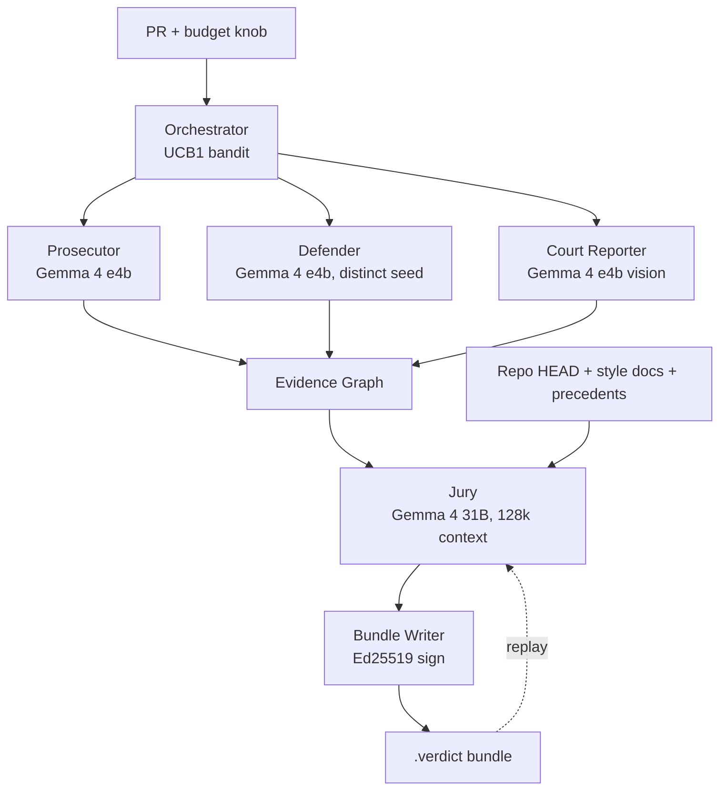

# Counterfactual Court

Four Gemma 4 agents argue and deliberate over a pull request. The output is a signed, replayable `.verdict` bundle.

[](https://github.com/moonrunnerkc/counterfactual-court/actions/workflows/ci.yml)
[](./LICENSE)
[](./package.json)
[](./runtime.lock.json)


## What this does

Counterfactual Court reads a PR locally, runs a Prosecutor and a Defender against the patch, lets a Court Reporter handle attached images and diagrams, and asks a Jury holding the whole repo in a 128k window to render a verdict. Every run writes a content-addressed, Ed25519-signed bundle that includes the evidence graph, the allocation trace from the budget bandit, and the precedent citations. The bundle replays bit-identical with Wi-Fi off.

## 60-second try-it

```bash
# pull the four pinned Gemma 4 model files via Ollama
./scripts/pull-models.sh

# run the local court against a fixture PR (single-file zod cidrv6 fix)
npx gemmacourt run --fixture zod-5945-cidrv6 --evidence-graph

# replay the bundle that was just written. no network needed.
npx gemmacourt replay ./bundles/<bundle-id>.verdict

# verify the signature only (no LLM calls, < 100ms)
npx gemmacourt verify ./bundles/<bundle-id>.verdict
```

The `try` flow expects `ollama serve` running on `localhost:11434` and a Mac with at least 64 GB unified memory. Pinned digests live in [`runtime.lock.json`](./runtime.lock.json); replay refuses to run on a different digest unless `--tolerate-runtime` is passed.

## Architecture



The Prosecutor and Defender see only the patch and their own working set. The Court Reporter sees only the multimodal attachments. The Jury is the one agent that sees everything (repo HEAD, both dossiers, all exhibits, AGENTS.md, CONTRIBUTING.md, STYLE_GUIDE.md, cited precedents) and emits the evidence graph from which its prose opinion is generated.

## Model assignment

| Agent          | Variant (Ollama tag)                                   | Why this variant                                                                                           |
| -------------- | ------------------------------------------------------ | ---------------------------------------------------------------------------------------------------------- |
| Prosecutor     | `gemma4:e4b-it-q8_0`                                   | Fast 4B-class generator for adversarial mutations and cheat-pattern probes.                                |
| Defender       | `gemma4:e4b-it-q8_0` (distinct prompt + seed; ADR-004) | Per-exhibit rebuttals; the bottleneck is prompt-following, not reasoning headroom.                         |
| Court Reporter | `gemma4:e4b-it-q8_0` (multimodal)                      | Native Gemma 4 vision handles OCR on screenshots, Mermaid extraction, and frame samples from short videos. |
| Jury           | `gemma4:31b-it-q8_0`                                   | 128k context holds the repo at HEAD plus both dossiers plus style guides without summarizing.              |

The four-role architecture is locked to the Gemma 4 family (ADR-001). Two roles share a model file; each is treated as a distinct agent with a distinct prompt and a distinct seed. ADR-004 explains why the 26B MoE variant was retired from production paths after the Phase 2F bench.

## Differentiators

Four mechanics that, taken together, are not matched by the prior art listed in [`docs/PRIOR_ART.md`](./docs/PRIOR_ART.md).

**Signed, replayable verdict bundles.** Every `gemmacourt run` writes a content-addressed bundle with an Ed25519 signature, the evidence graph, the budget allocation trace, and the model digests. `gemmacourt replay` re-runs the bundle and reports per-agent hash matches. Concrete: bundle `7c0d9499...` from the Phase 1 first verdict (`zod#5945`, cidrv6 regex fix) replays bit-identical with three response hashes byte-equal to the recording.

**Cross-PR precedent ledger.** A local content-addressed store at `~/.gemmacourt/ledger/` keeps prior verdicts. Before deliberation, the Jury queries by structural similarity (cosine over TS SyntaxKind histograms) and is required to justify every cited precedent inside the evidence graph. Concrete: in the Phase 2 multi-file e2e, the bandit run cited the seeded sample-patch verdict at similarity 0.990 and emitted the supporting `precedent-1` node in the graph.

**Structured evidence graph as primary output.** The Jury emits typed nodes (exhibit, citation, test-case, precedent, verdict) and typed edges (supports, refutes, depends-on); the prose opinion is generated from the graph, not the other way around. Concrete: the multi-file e2e bundle is an 8-node, 8-edge graph with three monorepo citations at depth 1 to 2 (`calculator/cli/report`).

**UCB1 dynamic compute budget.** A textbook UCB1 bandit allocates the per-run budget across `prosecution-rollout`, `defense-rebuttal`, and `jury-round`. The reward is derived from evidence-graph node delta plus jury-confidence delta (ADR-003) and is deterministic given the seed, so the schedule replays. Concrete: the multi-file e2e ran a 10-step trace covering all three arms with real LLM rewards (P=4 sum 4.0, D=2 sum 0.05, J=4 sum 4.0), embedded in the bundle.

## Bench

`bench/` ships MaliciousPatch-Bench: 100 real merged PRs from MIT/Apache-2.0/BSD-3 OSS plus 100 deterministically poisoned counterparts across five categories (logic errors, security vulnerabilities, test weakening, prompt-injection comments, license laundering). Methodology and one worked example per category are documented in [`bench/METHODOLOGY.md`](./bench/METHODOLOGY.md). Numbers and the cross-tool comparison are in [`bench/RESULTS.md`](./bench/RESULTS.md) (full 200-patch run is queued for the v0.1.0 release; the smoke run on 10 patches is the current public number).

## Determinism contract

Five rules, enforced by the source tree:

1. No `Math.random`, `Date.now`, `crypto.randomUUID` in agent or orchestrator code. Use `ctx.rng` and `ctx.clock`.
2. No env reads outside `src/runtime/config.ts`.
3. No filesystem writes outside `src/runtime/bundle-writer.ts`.
4. LLM calls go through `src/runtime/llm-client.ts` with explicit temperature, top-p, top-k, and seed.
5. Model output is parsed via zod schemas in `src/evidence/schema.ts`. No `JSON.parse` of raw output.

Residual quantized-inference variance per platform is measured in [`docs/runtime-variance.md`](./docs/runtime-variance.md). A `--tolerance` flag exposes the documented per-platform number to replay.

## Links

- Prior art and deltas: [`docs/PRIOR_ART.md`](./docs/PRIOR_ART.md)
- Architectural decisions: [`docs/DECISIONS.md`](./docs/DECISIONS.md)
- Agent reference (the Jury reads this at deliberation): [`docs/AGENTS.md`](./docs/AGENTS.md)
- Bench corpus and methodology: [`bench/METHODOLOGY.md`](./bench/METHODOLOGY.md)
- Build status and roadmap: [`BUILD_PLAN.md`](./BUILD_PLAN.md)

## License

[MIT](./LICENSE).
