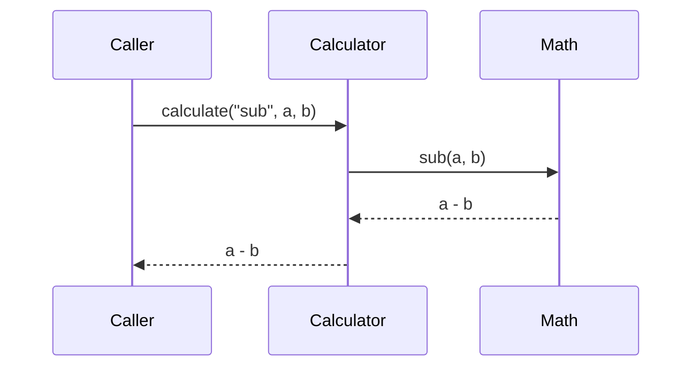

# Wire up subtraction support

This PR threads a new `sub` operator through the calculator. The sequence below shows the intended call path:

```mermaid
sequenceDiagram
  Caller->>Calculator: calculate("sub", a, b)
  Calculator->>Math: sub(a, b)
  Math-->>Calculator: a - b
  Calculator-->>Caller: a - b
```

That is all.
